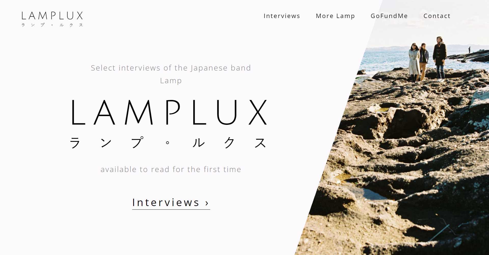

# LAMPLUX

LAMPLUX is a website which hosts various interviews of the Japanese musical group Lamp. Professionally transcribed and translated from Japanese-only audio via a grassroots fundraising effort, these interviews are now available to read for the first time ever!

[Visit LAMPLUX](https://www.lamplux.org/)  

## Roadmap

Future Goals:  

•Incorporate all transcriptions.  

•Make the site fully bilingual (English & Japanese), with a dedicated subdirectory for each language.

•Incorporate favicon once designed.

## Additional Links

Support Lamp! It's their wonderful art that ultimately inspired everything that led to LAMPLUX:  
[Lamp - Linktree](https://linktr.ee/lampjapan)  

Check out the GoFundMe for the interview transcriptions that LAMPLUX hosts:  
[Transcribe Interviews of Lamp (Japanese Band) - GoFundMe](https://www.gofundme.com/f/transcribe-lamp-interviews)